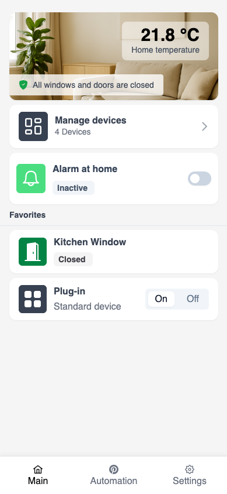
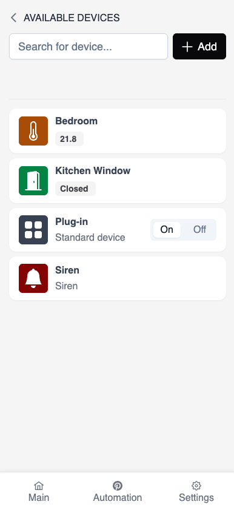
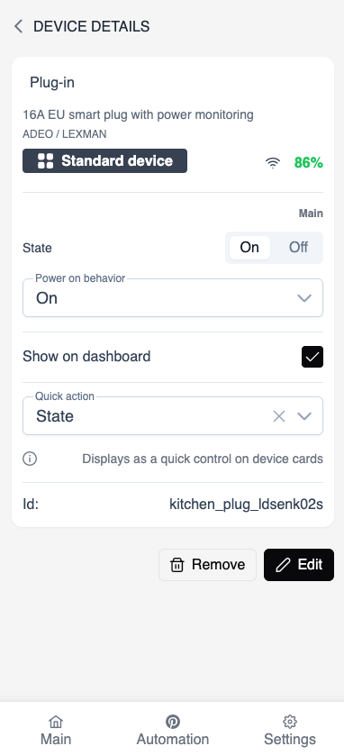

# Sparrow Home

Modern local-first smart home platform built with Angular and NestJS.

Sparrow Home is a self-hosted home automation system focused on privacy, local execution, and a modern mobile-first experience. It integrates with Zigbee2MQTT, MQTT devices, and custom automations while remaining lightweight and fully under user control.

---

<div style="display: flex; gap: 1rem">
 


</div>

## Features

- Local-first architecture
- Mobile-first interface
- Zigbee2MQTT integration
- MQTT-based communication
- Scheduled automations
- Push notifications
- Self-hosted deployment
- Nx monorepo architecture

## Tech Stack

### Frontend

- Angular
- PrimeNG

### Backend

- NestJS
- PostgreSQL
- TypeORM
- Swagger API

### Infrastructure

- Docker
- MQTT
- Zigbee2MQTT

Make sure the following tools are installed on your machine:

- **Node.js** (LTS recommended)
- **Docker** and **Docker Compose**
- **Git**

No global installation of databases, MQTT brokers, or Zigbee tooling is required outside Docker.

---

## Installing locally (for development)

To install **Sparrow Home** locally, first clone the repository:

```bash
git clone https://github.com/sparrow-codes/sparrow-home.git
```

Then install the dependencies:

```bash
cd sparrow-home

npm install
```

This configuration is for local development only. Do not use it in production.

A configuration file is required to run Sparrow Home locally in development mode:

- `.env` for the **backend (NestJS)**

It is environment-specific and will not be added to version control. You can use the provided example files as a starting point.

---

## Backend Configuration

Backend configuration is read from:

```text
apps/server/.env
```

example file:

```text
mode='development'

dbHost=localhost
dbPort=5432
dbUserName=sparrow
dbPassword=sparrow
dbName=sparrow_home

jwtSecret=REPLACE_WITH_RANDOM_STRING
jwtExpiry=5d

mqttUrl=mqtt://localhost:1883
```

## Start the application locally

For convenience, a `docker-compose.yaml` file is provided to start the application locally.

```text
docker compose -f ./docker-local/docker-compose.yaml -p docker up -d
```

Run frontend:

```text
npx nx run sparrow-home-mobile:serve:development
```

Run backend:

```text
npx nx run server:serve:development
```

You now have a fully functional Sparrow Home installation running locally. Go to [http://localhost:4200](http://localhost:4200) to see the application.


Contact: contact@sparrow-home.net

## License

This project is licensed under the MIT License.
See the [LICENSE](./LICENSE) file for details.

